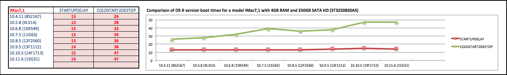

# OSXcoldstart2desktopTimer
Calculate how long it takes to get to a desktop from cold on OSX.

##Description:

This script calculates how long it takes to get from a cold boot to a useable desktop on OSX.

During the calculations the script powers-off, then auto powers-on the Mac many times. The whole thing takes between 45 minutes to complete.

A typical users perception of speed is how fast they can boot up, log on, and get to a usable desktop. 

With the oldest machines, this process seems to slow down with every major OS update. I just wanted to confirm what was what was happening.

The script works via a system-level LaunchDaemon and a per-user LaunchAgent which are removed when the timings have completed.

##Disclaimer:
The script powers on and off several times. If you are unsure, do not install.

##How to install:

1. Log in as a user with Admin rights
2. Enable Auto log in for the user
   (System Preferences>Users & Groups>Login Options>Automatic login)
3. Double-click the script "OSXcoldstart2desktopTimer.command"
   Enter your password when requested.
4. Quit all running applications"
5. Close all windows
6. Reboot

##Aborting:

To stop the process prematurely, wait for the workstation to switch off, then immediately switch it on again.

If for some reason the script will not abort, boot into Single-User mode and delete the following files:

	  /Users/<yourloginname>/Library/LaunchAgents/OSXcoldstart2desktopTimer-timer.plist"
	  /Library/LaunchDaemons/OSXcoldstart2desktopTimer-SchedulePowerOn.plist"
  
##Results:

The results can be read from the log file that is placed in the same folder as the script.

- Average BOOTLOGDELAY
  This is how long it took to start logging. Basically, this is the delay that you see before OSX starts to load (the grey screen before the apple logo appears).

- Average COLDSTART2DESTOP
  This is how long it took on average to start up to a useable desktop.

##Example Results:

Versions of the OS for 10.6 and above were timed on a freshly installed OS.

Versions 10.4 and 10.5 were timed on an existing image, since I no longer had the installation media.

Each Mac HD was set up with a GUID Partition Scheme.

The results in the example spreadsheets show that in general, each OS is generally slower at getting to a useable desktop than the previous OS was.

###iMac7,1 Results

The iMac7,1 test results in the spreadsheet were executed on a 4GB Mac with a 250GB HD. 

The results show that on an iMac7,1 and a base OS with no Applications - 10.4.11 gets to a useable desktop in 26 seconds whereas on 10.11.6 it averages 47 seconds.

##History:

1.0.8 - 21 JUL 16

* Timings for more Mac models added.

* Changed script to run for a fixed length of time, rather than a fixed number of reboots.

* The script now times how long it takes to do a shutdown before the main timings begin.

* Skewed results are discarded using Chauvenet’s criterion.

1.0.7 - 31 MAY 16

* Timings updated for latest OS version.
* Moved to GitHub

1.0.6 - 26 AUG 15

* Timings updated for latest OS version.
* Minor changes to script.

1.0.5 - 29 OCT 14

* First release
